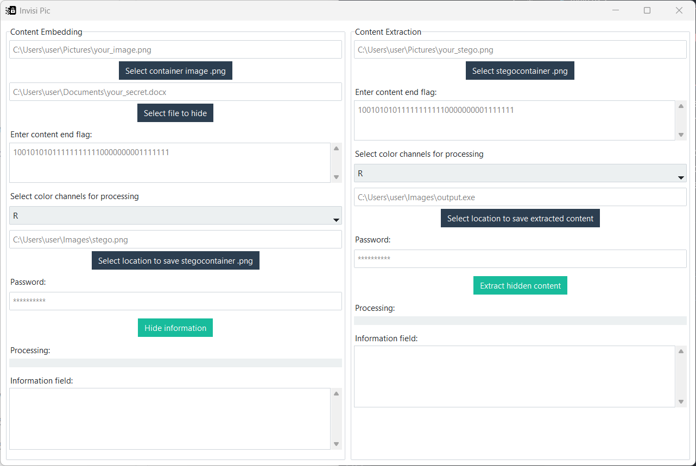

# Invisi Pic

This application is a steganographic tool designed to securely hide files within PNG images using the Least Significant Bit (LSB) method. It features a user-friendly graphical interface with customizable settings for selecting specific RGB channel combinations, and includes built-in stream encryption based on the ChaCha20 algorithm to ensure robust data protection.


# 💻 OS Support

| Operating System | Supported? |
|------------------|------------|
| Windows          | ✅ Yes     |
| macOS            | ❌ No      |
| Linux            | ❌ No      |

# How to Run the Project

## 🟩 Option 1: Run the Executable
You can download the `.exe` file from the [Releases](https://github.com/Amahing/invisi-pic/releases) section.

---

## 🛠 Option 2: Run from Source Code

### 1. Clone the Repository
```bash
git clone https://github.com/Amahing/invisi-pic.git
cd invisi-pic
```

### 2. Install uv

#### On Windows (PowerShell):
```bash
powershell -ExecutionPolicy ByPass -c "irm https://astral.sh/uv/install.ps1 | iex"
```

### 3. Run the Application
From inside the project directory, execute:
```bash
uv run main.py
```

# Guide to using the application
#### Screenshot app


### 🔐 Hiding Information — Step by Step

- Choose a cover image in `.png` format to serve as the container.
- Select the file to hide (any format; multiple files can be archived into `.zip`).
- Enter an end control flag — a binary string (e.g., `010101...`) used to mark the end of hidden data. Recommended length: **128 bits**.
- Select RGB channels to be used for hiding data (`R`, `G`, `B` or combinations).
- Specify the output path and filename for the resulting `.png` image.
- Enter a password for stream encryption (`ChaCha20`).
- Click **“Hide information”** and wait for confirmation.


### 🔍 Extracting Information — Step by Step

- Select a stegocontainer (`.png`) that holds hidden data.
- Enter the end control flag used during hiding (binary string).
- Choose the same RGB channels that were used in the embedding process.
- Set the output file path and name for the extracted data.
- Enter the password used for encryption to decrypt the data.
- Click **“Extract hidden content”** and wait for the success message.

---

## Thanks for checking out this project! 🚀  
If you find it useful, consider giving it a ⭐ on GitHub.